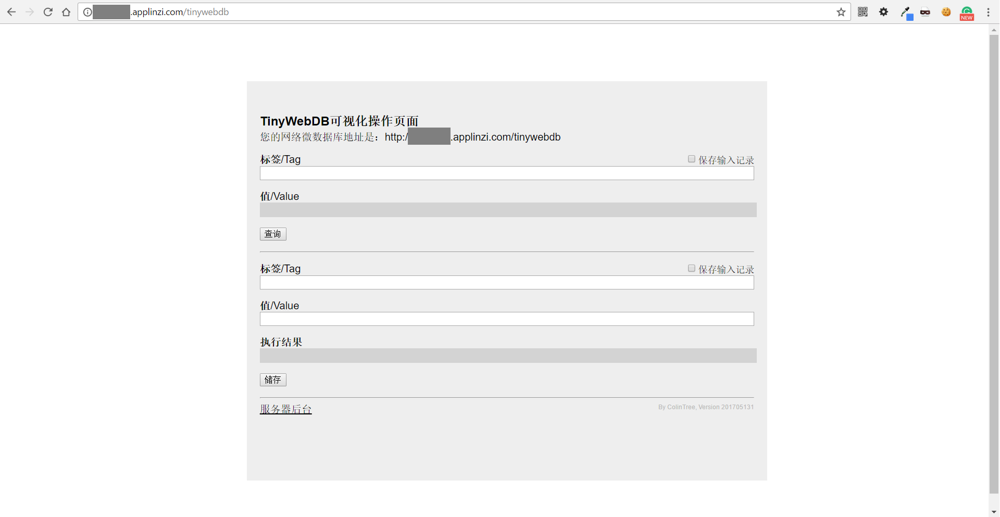

 

## TinyWebDB_SAE_PHP (TSP)
[首页](/) - [下载页](下载页) - [安装方法](安装方法) - [使用手册](使用手册)
  
***
 
## 目录：
* [前台页面(可视化页面)](#前台页面可视化页面)
  * [获取](#获取)
  * [储存](#储存)
* [文件的上传与下载](#文件的上传与下载)
  * [上传](#上传)
  * [下载](#下载)
* [外部访问](#外部访问)
  * [外部获取](#外部获取)
  * [外部储存](#外部储存)
* [后台页面](#后台页面)
  * [基础操作](#基础操作)
  * [搜索](#搜索)
  * [备份/重置](#备份重置)
  * [文件系统](#文件系统)
  * [设置](#设置)
    * [标签浏览页设定](#标签浏览页设定)
    * [数据安全](#数据安全)
    * [特殊标签功能](#特殊标签功能)
    * [备份相关](#备份相关)
    * [修改密码](#修改密码)
    * [清除数据](#清除数据)
  
***
  
## 前台页面(可视化页面)
[回到目录](#目录)  
如图所示，这是截至 20170513_1版本 的前台页面图：
可见页面主要是两个功能：对标签的 获取 和 储存  

### 获取
[回到目录](#目录)  
* 获取一个指定的标签，只需要在上半部分的标签/Tag一栏内填入需要获取的标签名，然后点击下方按钮(或者回车)
* 获取带有特殊功能的标签，请对照以下列举的功能使用  
  如在[设置](#%E7%89%B9%E6%AE%8A%E6%A0%87%E7%AD%BE)中修改了此部分，请按需修改，此处仅按照系统默认值进行讲解
  * 标签计数  
    默认标签：special_count  
    参数：前缀，如果留空则表示获取整个数据库的标签数量  
    返回：一个数字，代表对标签的数量的统计结果  
    样例1：获取所有标签的数量 => “special_count”  
    样例2：获取所有前缀为“setting_”的标签的数量 => “special_count#setting_”
  * 批量获取指定前缀的标签  
    默认标签：special_mget  
    参数：前缀，如果留空则表示获取所有数据库内的标签  
    返回：一个键值对列表，内容是所有符合前缀要求的标签。例如：列表((tag1 value1) (tag2 value2))  
    样例1：获取所有标签（如数据库内的数据数量较大，请慎重使用） => “special_mget”  
    样例2：获取所有前缀为“setting_”的标签 => “special_mget#setting_”
  * 批量获取指定标签  
    默认标签：special_listget  
    参数：标签1，标签2……。每个标签之间使用一个“#”隔开  
    返回：一个键值对列表，内容是所有请求的标签。例如：列表((tag1 value1) (tag2 value2))  
    样例：获取标签“setting_password”和“setting_version” => “special_listget#setting_password#setting_version”
  * 搜索标签  
    （搜索范围包括，符合参数内要求的前缀的 **标签和值**）  
    默认标签：special_search  
    参数：关键词，想要搜索的关键字眼，不支持空格分词 ； 前缀，如果留空则表示获取整个数据库的标签数量  
    返回：一个键值对列表，内容是对符合前缀要求的标签的搜索结果。例如：列表((tag1 value1) (tag2 value2))  
    样例1：在所有前缀为“setting_”的标签中，搜索“password” => “special_search#password#setting_”  
    样例2：在所有标签中，搜索“password” => “special_search#password”  
    样例3：相当于获取所有标签（如数据库内的数据数量较大，请慎重使用） => “special_search”

### 储存
[回到目录](#目录)  
储存一个值到一个指定的标签，需要在下半部分的“标签/Tag”一栏内填入要储存的标签名，在“值/Value”一栏内填入要储存的值，然后点击下方按钮(或者回车)
  
***
  
## 文件的上传与下载
[回到目录](#目录)  
本系统内置了一个完整的文件上传下载系统（以及一个[后台管理界面](#后台管理界面)）
### 上传
[回到目录](#目录)  
上传文件的方式是通过Appinventor的 Web客户端 组件POST文件至服务器完成的  
（或者是使用其他语言的Octet-Stream方式上传）  
**注意：文件大小不得超过4MB**  
而根据不同的上传操作需求，系统设置了不同的上传路径：  
* 新建文件(file或addfile) - 上传文件并新建至指定文件名，若文件存在则返回错误  
  http://{您的appID}.applinzi.com/tinywebdb/file?filename={文件名}  
  或  
  http://{您的appID}.applinzi.com/tinywebdb/addfile?filename={文件名}  
* 保存文件(savefile) - 上传并保存，无论是否已经存在该文件  
  http://{您的appID}.applinzi.com/tinywebdb/savefile?filename={文件名}  
* 更新文件(updatefile) - 上传并更新文件，如果该文件已经存在则返回错误  
  http://{您的appID}.applinzi.com/tinywebdb/updatefile?filename={文件名}  
  **对于任何一种上传方式：成功则返回外网可以直接访问的文件网址，失败则返回"失败/FAIL"**  

参数解释：filename={文件名}  
这个地方的文件名可以包含“/”，以作为目录结构使用  
例如上传了带有参数：“filename=/dir/file.txt”的文件之后  
在后台页面将会显示/dir/目录下有一个文件叫做/file.txt  
而下载时也可以直接使用http://{您的appID}.applinzi.com/tinywebdb/file/dir/file.txt  
### 下载
[回到目录](#目录)  
最简单的方法：访问上传之后返回的路径  
如果再上传的时候没有保存，那么请按照如下规则访问文件：  
http://{您的appID}.applinzi.com/tinywebdb/file/{上传的时候的文件名}  

例如：上传时保存的文件名为：/dir/file.txt  
     那么获取时只需要访问 http://{您的appID}.applinzi.com/tinywebdb/file/dir/file.txt 即可  
     (前提是服务器开放了对该文件的访问权限)  
  
***
  
## 外部访问
[回到目录](#目录)  
如果访问是通过浏览器进行的，可能会受到 设置>数据安全>允许来自浏览器对数据库的访问
 的影响
### 外部获取
[回到目录](#目录)
* 方法：POST
* 参数：tag={要获取的标签名，支持特殊标签功能}
* 网址：http://{您的appID}.applinzi.com/tinywebdb/getvalue
* 返回：JSON格式：["VALUE","{标签名}","{值}"]
### 外部储存
[回到目录](#目录)
* 方法：POST
* 参数：tag={要储存的标签名}&value={要储存的值}
* 网址：http://{您的appID}.applinzi.com/tinywebdb/storeavalue
* 返回：JSON格式：["STORED","{标签名}","{值}"]

  
***
  
## 后台页面
[回到目录](#目录)
### 基础操作
[回到目录](#目录)
### 搜索
[回到目录](#目录)
### 备份/重置
[回到目录](#目录)
### 文件系统
[回到目录](#目录)
### 设置
[回到目录](#目录)  
* #### 标签浏览页设定
* #### 数据安全
* #### 特殊标签功能
* #### 备份相关
* #### 修改密码
* #### 清除数据
  
***
  
By Colintree @ colintree.cn (Email: 502470184@qq.com \|\| colinycl123@gmail.com)

 
